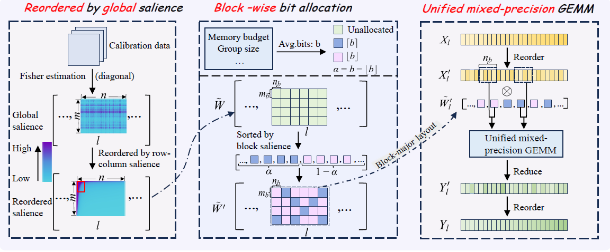

# SFMP: Fine-Grained, Hardware-Friendly and Search-Free Mixed-Precision Quantization for Large Language Models

This repository provides an official implementation of **SFMP**, a **search-free** and **hardware-friendly** mixed-precision framework for rescource-constrained language models. If you find this work useful, we would appreciate it if you could give us a star ⭐.
<p align="center">
  <a href="https://arxiv.org/abs/2602.01027">
    
  </a>
</p>



## News 
- [2026/4] We now support three bit-width options (e.g., 2, 3, and 4), which can improve performance 


## Key Features

- **Fine-grained**: A block of size, for example, (512, 128), serves as the minimal unit of quantization.
- **Search-Free**: Given a memory budget, the bit allocation scheme can be determined without any search.
- **Unified GEMM Kernel**: A unified CUDA kernel supports matrix multiplication with arbitrary average bit-widths.
- **Weight Reordering Strategy**: Aggregates important weights while introducing only negligible inference overhead.
- **Multiple Quantization Methods**: Supports multiple quantization methods, including AWQ, GPTQ, EfficientQAT, and more.

## Model Zoo
We provide a set of pre-quantized EfficientQAT models. You can download and evaluate the models in the `eval` directory to reproduce our results. More models will be released soon.

- WikiText2 PPL is measured in 2048 context length.
- Avg. Accuracy indicate the average accuracy in 6 zero-shot reasoning tasks (WinoGrande,PIQA,HellaSwag,Arc-Easy, Arc-Challenge, BoolQ) with [lm-eval v0.4.9](https://github.com/EleutherAI/lm-evaluation-harness).

| Model | Quantization | WikiText2 PPL | Avg. Accuracy | Model Size (GB) | Hub link|
|-------|--------------|---------------|---------------|-----------------|----------|
Llama-3.1-8B|FP16|6.15|75.01|15.3| - 
Llama-3.1-8B|w2.25-g128-BPW2.5|14.49|64.34|4.0|[SFMP](https://www.modelscope.cn/models/niexin666/SFMP/tree/master/llama3.1-8b-mixprecision-wbits2.25-g128-BPW2.5)
Llama-3.1-8B|w2.75-g128-BPW3.0|9.51|69.74|4.4|[SFMP](https://www.modelscope.cn/models/niexin666/SFMP/tree/master/llama3.1-8b-mixprecision-wbits2.75-g128-BPW3.0)
Llama-3.1-8B|w3.25-g128-BPW3.5|7.19|72.97|4.9|[SFMP](https://www.modelscope.cn/models/niexin666/SFMP/tree/master/llama3.1-8b-mixprecision-wbits3.25-g128-BPW3.5)
Llama-3.1-8B|w3.75-g128-BPW4.0|6.80|74.33|5.3|[SFMP](https://www.modelscope.cn/models/niexin666/SFMP/tree/master/llama3.1-8b-mixprecision-wbits3.75-g128-BPW4.0)
qwen3-8B|FP16|9.73|74.20|15.5| - 
qwen3-8B|w2.25-g128-BPW2.5|16.50|66.16|4.4|[SFMP](https://www.modelscope.cn/models/niexin666/SFMP/tree/master/qwen3-8b-mixprecision-wbits2.25-g128-BPW2.5)
qwen3-8B|w2.75-g128-BPW3.0|12.0|71.51|4.8|[SFMP](https://www.modelscope.cn/models/niexin666/SFMP/tree/master/qwen3-8b-mixprecision-wbits2.75-g128-BPW3.0)
qwen3-8B|w3.25-g128-BPW3.5|10.41|72.74|5.2|[SFMP](https://www.modelscope.cn/models/niexin666/SFMP/tree/master/qwen3-8b-mixprecision-wbits3.25-g128-BPW3.5)
qwen3-8B|w3.75-g128-BPW4.0|9.96|73.29|5.6|[SFMP](https://www.modelscope.cn/models/niexin666/SFMP/tree/master/qwen3-8b-mixprecision-wbits3.75-g128-BPW4.0)


## 🔧 Installation
```bash
conda create -n sfmp python=3.11
conda activate sfmp
pip install -r requirements.txt
pip install -e .
```

## 🚀 Usage Examples

### 0. Estimate Global Salience
```bash
cd salience
CUDA_VISIBLE_DEVICES=0 python run.py --output_dir llama3.1_8b_salience  --model_name path/to/llama3.1_8b_hf 
```

### 1. Bit Allocation and Run AWQ 
```bash
cd AWQ

# run mixed-precision quantization pipeline
CUDA_VISIBLE_DEVICES=0 python awq.py --model_name path/to/llama3.1_8b_hf  \
 --sensitivity_path llama3.1_8b_salience  \
 --use_bitallocation --wbits 2.25 \
 --use_colreorder --use_rowreorder --clip_asym --row_interval 512 --groupsize 128 \
 --real_quant  \
 --save llama3.1-8b-mixprecision
```
### 2. Eval 
```bash
cd eval

# eval ppl
CUDA_VISIBLE_DEVICES=0 python eval.py --model_path llama3.1-8b-mixprecision-wbits2.25-g128-BPW2.5 \
 --wbits 2.25 --group_size 128 \
 --outfeature_interval 512 --eval_ppl

# eval zero-shot tasks
CUDA_VISIBLE_DEVICES=0 python eval.py --model_path llama3.1-8b-mixprecision-wbits2.25-g128-BPW2.5 \
--wbits 2.25 --group_size 128 \
--outfeature_interval 512 --eval_tasks hellaswag,winogrande,arc_easy,arc_challenge,piqa,boolq --eval_batch_size 16

# eval 5-shot mmlu and gsm8k
CUDA_VISIBLE_DEVICES=0 python eval.py --model_path llama3.1-8b-mixprecision-wbits2.25-g128-BPW2.5 \
--wbits 2.25 --group_size 128 \
--outfeature_interval 512 --eval_tasks gsm8k,mmlu --eval_batch_size 8 --num_fewshot 5

```


## ⚡GPU Inference

### 0. Install CUDA kernel for LUT-Based GEMV
```bash
cd Inference/GPU/bcqinference/custom_kernel
source do_install.sh
```

### 1. Prepare for BCQ format
```bash
cd scripts
python export2bcq.py \
  --resume_quant llama3.1-8b-mixprecision-wbits2.25-g128-BPW2.5 \
  --wbits 2.25 \
  --group_size 128 \  
  --outfeature_interval 512 \
  --save_path llama3.1-8b-mixprecision-2.5-PreBCQ
```

### 2. convert to BCQModel
```bash
cd Inference/GPU/bcqinference

python convert_to_bcq.py \
  --model_path llama3.1-8b-mixprecision-2.5-PreBCQ \
  --output_dir llama3.1-8b-mixprecision-2.5-BCQ
```

### 3. Throughput Evaluation

```bash
cd Inference/GPU/bcqinference

CUDA_VISIBLE_DEVICES=1 python generate.py 
 --compile 2 \
 --num_samples 5  \
 --model_name "meta-llama/Llama-3.1-8B"  \
 --bitwidth 2.25 \
 --dtype "float16"  \
 --backend bcq \
 --max_new_tokens 128 \
 --checkpoint_path llama3.1-8b-mixprecision-2.5-BCQ \
 --group_size 128 \
 --outfeature_interval 512 

```


## 📖 Citation

```bibtex
@article{nie2026sfmp,
  title={SFMP: Fine-Grained, Hardware-Friendly and Search-Free Mixed-Precision Quantization for Large Language Models},
  author={Nie, Xin and Zhang, Haicheng and Dong, Liang and Feng, Beining and Weng, Jinhong and Sun, Guiling},
  journal={arXiv preprint arXiv:2602.01027},
  year={2026}
}
```
